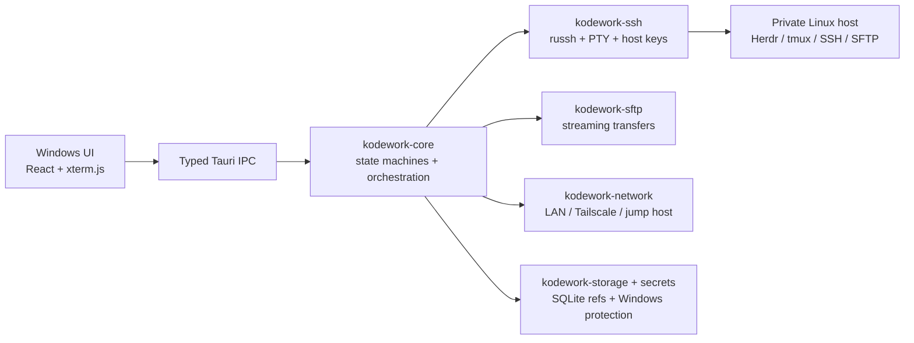

# KodeWork

> **Windows control plane for private Linux coding workspaces.**

KodeWork is a fast, local-first Windows workbench for connecting to Linux machines that are not directly exposed to the public internet. It combines Tailscale or an SSH jump host, SSH/PTY, Herdr/tmux session continuity, SFTP, clipboard asset upload, port-forwarded previews, and a native Windows desktop workflow.

It is not another generic terminal tab manager. The product is built around one promise:

> Start a coding workspace on a remote Linux host, disconnect whenever you want, and come back to the same work without giving the host a public IP.

## Why KodeWork

Most SSH clients stop at “open a shell”. KodeWork treats the remote machine as a durable coding workspace:

1. **Reach private hosts** — discover Tailscale addresses, use fallback addresses, or chain through a jump host.
2. **Attach to durable work** — use Herdr or tmux on the remote host so a Windows restart or network flap does not destroy the task.
3. **Work from one surface** — terminal panes, actions, Herdr runtime state, files, transfers, screenshots/PDFs, and web previews share one project context.
4. **Keep control local** — credentials stay behind the Windows secure-storage boundary; the renderer does not receive private key material or passwords.

## Feature map

| Area | What KodeWork provides |
| --- | --- |
| Network | Embedded userspace Tailscale, system-daemon discovery, address fallback, SSH jump-host chains |
| Terminal | Rust SSH/PTY core, xterm.js renderer, split panes, CJK/IME support, reconnect state |
| Durable sessions | Herdr and tmux attach/reconnect workflow |
| Clipboard | Mouse selection copy, Herdr/tmux/Vim OSC 52 writes to the Windows clipboard, clipboard reads disabled |
| Files | Virtualized large directories, SFTP streaming, resume/pause/retry/cancel, per-host pinned folders |
| Assets | Paste screenshots, images, and PDFs; validate and upload them into the active remote workspace |
| Automation | Interactive, quick, and background Actions with server-side danger classification and Run history |
| Preview | SSH local port forwarding and loopback Web Preview |
| Windows | Tray residency, single instance, autostart, signed updater artifacts, configurable themes |

## Architecture



The Rust core does not depend on Tauri types. The desktop shell is replaceable; connection lifecycle, transfer state, security policy, and remote-session continuity are not tied to the React UI.

## Security principles

- Unknown SSH host keys require an explicit fingerprint decision; changed keys are hard failures.
- Passwords, private-key passphrases, and Tailscale auth keys never enter ordinary renderer persistence, command-line arguments, or logs.
- Destructive Actions are classified again by Rust; the UI cannot mark a dangerous command as safe.
- OSC 52 accepts only bounded UTF-8 clipboard writes. Remote clipboard reads are intentionally ignored.
- SFTP uploads are streamed and staged atomically instead of reading entire files into memory.
- Production CSP is restrictive; loopback frames are allowed only for the explicit SSH Web Preview feature.

## Development

### Prerequisites

- Windows 10/11 x64
- Rust stable with the MSVC toolchain
- Node.js 20+ and npm
- Tauri 2 Windows development prerequisites

### Commands

```powershell
npm ci
npm run dev              # browser-only preview; no native SSH or credentials
npm run desktop          # Tauri desktop development
npm run lint
npm run test:frontend
npm run build
cargo fmt --all -- --check
cargo clippy --workspace --all-targets --all-features -- -D warnings
cargo test --workspace --all-features
```

For a release build, use `scripts/build-release.ps1`. It prepares pinned Tailscale sidecars and produces the MSI plus Tauri updater signature. Commercial Authenticode signing is intentionally supplied by the distributor rather than committed to the repository.

## Repository layout

```text
crates/kodework-domain       Pure models and policy
crates/kodework-core         Session, tunnel, transfer orchestration
crates/kodework-ssh          SSH, PTY, host-key and jump-host logic
crates/kodework-sftp         Streaming SFTP transfer manager
crates/kodework-storage      SQLite migrations and repositories
crates/kodework-secrets*     Windows protected credential adapters
crates/kodework-tailscale    Tailscale CLI/userspace adapter
crates/kodework-herdr        Herdr CLI and socket bridge
src-tauri                    Thin typed IPC and Windows shell integration
src                           React workspace, terminal, files and settings
docs                          Architecture, ADRs, handoff and release notes
```

The `references/` directory is a local, ignored research area. It is not a build input and is not redistributed with KodeWork.

## Project direction

The near-term focus is not adding dashboard features. It is making the remote coding loop feel instantaneous and dependable:

- faster first-byte connection feedback and address selection;
- smooth terminal rendering under large output and many panes;
- high-throughput, resumable transfers;
- clear recovery after sleep, network loss, or application restart;
- a compact, keyboard-first Windows UI instead of a generic admin dashboard.

## Contributing and security

This repository uses the MIT License and is being prepared for public development. Before the first public source release, it will also include the contribution guide, security policy, CI, dependency update policy, and third-party notices. Never publish passwords, SSH private keys, Tailscale auth keys, updater signing keys, real hostnames, or private files.

## License

KodeWork is licensed under the [MIT License](LICENSE). Bundled Tailscale components retain their upstream BSD-3-Clause license. The public source release will include the relevant third-party notices alongside the source distribution.
