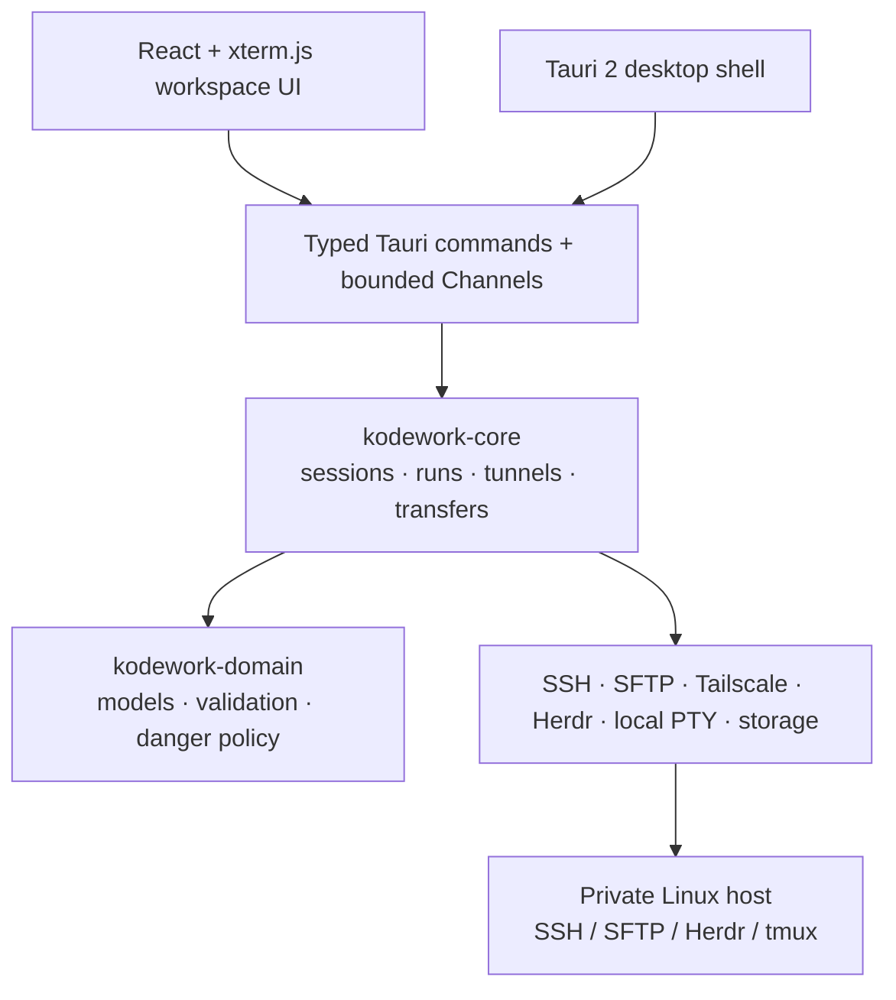

<p align="center">
  
</p>

<h1 align="center">KodeWork</h1>

<p align="center"><strong>A local-first workbench for durable coding sessions on private Linux hosts.
Windows desktop available today · Portable Rust core checked on Windows, macOS, and Linux</strong></p>

<p align="center">
  <a href="https://github.com/likangmax/KodeWork/actions/workflows/ci.yml"></a>
  <a href="https://github.com/likangmax/KodeWork/releases/latest"></a>
  <a href="LICENSE"></a>
  
</p>

<p align="center"><strong>English</strong> · <a href="README.zh-CN.md">简体中文</a></p>

KodeWork is a fast, local-first Windows workbench for connecting to Linux machines that are not directly exposed to the public internet. It combines Tailscale or an SSH jump host, SSH/PTY, Herdr/tmux session continuity, SFTP, clipboard asset upload, port-forwarded previews, and a native Windows desktop workflow.

It is not another generic terminal tab manager. The product is built around one promise:

> Start a coding workspace on a remote Linux host, disconnect whenever you want, and come back to the same work without giving the host a public IP.

## Start here

### I only want to use KodeWork

1. Download the **Windows x64 MSI** from [GitHub Releases](https://github.com/likangmax/KodeWork/releases/latest).
2. Run the installer, then launch KodeWork and choose **English** or **简体中文**. This is a first-launch app prompt; the MSI wizard itself is not localized yet.
3. Select **+** beside Workstations, enter your Linux host, choose a network path and authentication method, then connect.
4. Verify the SSH host-key fingerprint before trusting a new host.

New to SSH, Tailscale, Herdr, or jump hosts? Follow the complete [zero-to-connected user guide](docs/USER-GUIDE.md). It explains every field, all connection modes, upgrades, clipboard upload, files, WSL, durable sessions, and common failures.

### I am an AI agent or maintainer

Read the [agent and maintainer guide](docs/AGENT-GUIDE.md) or the [中文 Agent 指南](docs/AGENT-GUIDE.zh-CN.md) before changing code. They define repository boundaries, security rules, required tests, release evidence, privacy checks, and the safe pull-request workflow.

Current community builds are not Authenticode-signed because the project does not yet have a commercial Windows certificate. Windows SmartScreen may therefore show an unknown-publisher warning. Release checksums and the exact distribution limits are listed in each release and in [Project status](docs/STATUS.md).

## Platform availability

| Capability | Windows x64 | macOS | Linux desktop |
| --- | --- | --- | --- |
| Installable KodeWork desktop release | **Available (MSI)** | Not published | Not published |
| Native GUI/install/signing smoke tests | **Release baseline** | Not completed | Not completed |
| Portable Rust crates in CI | Checked | Checked | Checked |

Cross-platform core CI is not a macOS or Linux desktop release. Those platforms become supported only after native bundles, signing, installation, GUI smoke tests, sidecars, and release assets pass. See the [release matrix](docs/RELEASE-MATRIX.md).

## Why KodeWork

Most SSH clients stop at “open a shell”. KodeWork treats the remote machine as a durable coding workspace:

1. **Reach private hosts** — discover Tailscale addresses, use fallback addresses, or chain through a jump host.
2. **Attach to durable work** — use Herdr or tmux on the remote host so a Windows restart or network flap does not destroy the task.
3. **Work from one surface** — terminal panes, actions, Herdr runtime state, files, transfers, screenshots/PDFs, and web previews share one project context.
4. **Keep control local** — credentials stay behind the Windows secure-storage boundary; the renderer does not receive private key material or passwords.

## Feature map

| Area | What KodeWork provides |
| --- | --- |
| Network | Embedded userspace Tailscale, system-daemon discovery, address fallback, SSH jump-host chains |
| Terminal | Rust SSH/PTY core, xterm.js renderer, split panes, CJK/IME support, reconnect state |
| Durable sessions | Herdr and tmux attach/reconnect workflow |
| Clipboard | Mouse selection copy, Herdr/tmux/Vim OSC 52 writes to the Windows clipboard, clipboard reads disabled |
| Files | Virtualized large directories, SFTP streaming, resume/pause/retry/cancel, per-host pinned folders |
| Assets | Paste screenshots, images, and PDFs; validate and upload them into the active remote workspace |
| Automation | Interactive, quick, and background Actions with server-side danger classification; Quick and Background runs have durable history |
| Preview | SSH local port forwarding and loopback Web Preview |
| Desktop | English/Chinese UI preference, themes, tray, single instance, autostart, local PowerShell/CMD/WSL terminals, signed updater verification |

## Architecture



The desktop shell is intentionally thin. Rust owns connection truth, reconnect generations, authentication boundaries, transfer state, and remote-session continuity; React owns presentation and renderer lifecycle. Tailscale provides a network path, while SSH still performs authentication and host-key verification.

See the full boundary and data-flow description in [`docs/ARCHITECTURE.md`](docs/ARCHITECTURE.md) and the numbered decisions in [`docs/adr/`](docs/adr/).


## Documentation

- [User guide](docs/USER-GUIDE.md) · [中文用户指南](docs/USER-GUIDE.zh-CN.md)
- [Troubleshooting](docs/TROUBLESHOOTING.md)
- [Agent/maintainer guide](docs/AGENT-GUIDE.md)
- [Documentation map](docs/README.md)
- [Project status](docs/STATUS.md) · [Windows test matrix](docs/TEST-MATRIX-WINDOWS.md)
- [Architecture](docs/ARCHITECTURE.md) · [Release matrix](docs/RELEASE-MATRIX.md) · [Changelog](docs/CHANGELOG.md)
- [Cross-platform roadmap](docs/CROSS-PLATFORM-ROADMAP.md)

## Security principles

- Unknown SSH host keys require an explicit fingerprint decision; changed keys are hard failures.
- Passwords, private-key passphrases, and Tailscale auth keys never enter ordinary renderer persistence, command-line arguments, or logs.
- Destructive Actions are classified again by Rust; the UI cannot mark a dangerous command as safe.
- OSC 52 accepts only bounded UTF-8 clipboard writes. Remote clipboard reads are intentionally ignored.
- SFTP uploads are streamed and staged atomically instead of reading entire files into memory.
- Production CSP is restrictive; loopback frames are allowed only for the explicit SSH Web Preview feature.

## Development

### Prerequisites

- Windows 10/11 x64
- Rust 1.98.0 with the MSVC toolchain (the repository toolchain pin is in `rust-toolchain.toml`)
- Node.js 20+ and npm
- Tauri 2 Windows development prerequisites

### Commands

```powershell
npm ci
npm run dev              # browser-only preview; no native SSH or credentials
npm run desktop          # Tauri desktop development
npm run lint
npm run test:frontend
npm run build
cargo fmt --all -- --check
cargo clippy --workspace --all-targets --all-features -- -D warnings
cargo test --workspace --all-features
```

For a release build, use `scripts/build-release.ps1`. It prepares pinned Tailscale sidecars and produces the MSI plus Tauri updater signature. Commercial Authenticode signing is intentionally supplied by the distributor rather than committed to the repository.

## Repository layout

```text
crates/                    Rust domain, core, transport, storage and platform adapters
src-tauri/                 Thin Tauri shell, typed IPC, plugins and native resources
src/                       React workspace, terminal, files, runtime and settings UI
docs/                      Architecture, ADRs, quality evidence, release and license notes
scripts/                   Reproducible build, sidecar and verification helpers
.github/                   CI, release automation, issue forms and contribution templates
```

Build manifests and community-health files intentionally remain at the repository root so Cargo, npm, Vite, Tauri, and GitHub can discover them without custom configuration. The ignored `references/`, `target/`, `dist/`, and `node_modules/` directories are local/generated data and are not redistributed.


## Project status

KodeWork is usable today, but it remains an actively developed `0.x` project. The near-term focus is making the remote coding loop faster and more dependable:

- faster first-byte connection feedback and address selection;
- smooth terminal rendering under large output and many panes;
- high-throughput, resumable transfers;
- clear recovery after sleep, network loss, or application restart;
- a compact, keyboard-first Windows UI instead of a generic admin dashboard.

## Contributing and security

This repository uses the MIT License and accepts focused issues and pull requests. Read [CONTRIBUTING.md](CONTRIBUTING.md) before changing code and report vulnerabilities through [SECURITY.md](SECURITY.md). Never publish passwords, SSH private keys, Tailscale auth keys, updater signing keys, real hostnames, or private files.

## License

KodeWork is licensed under the [MIT License](LICENSE). Bundled Tailscale components retain their upstream BSD-3-Clause license; see [third-party notices](docs/THIRD-PARTY-NOTICES.md).
