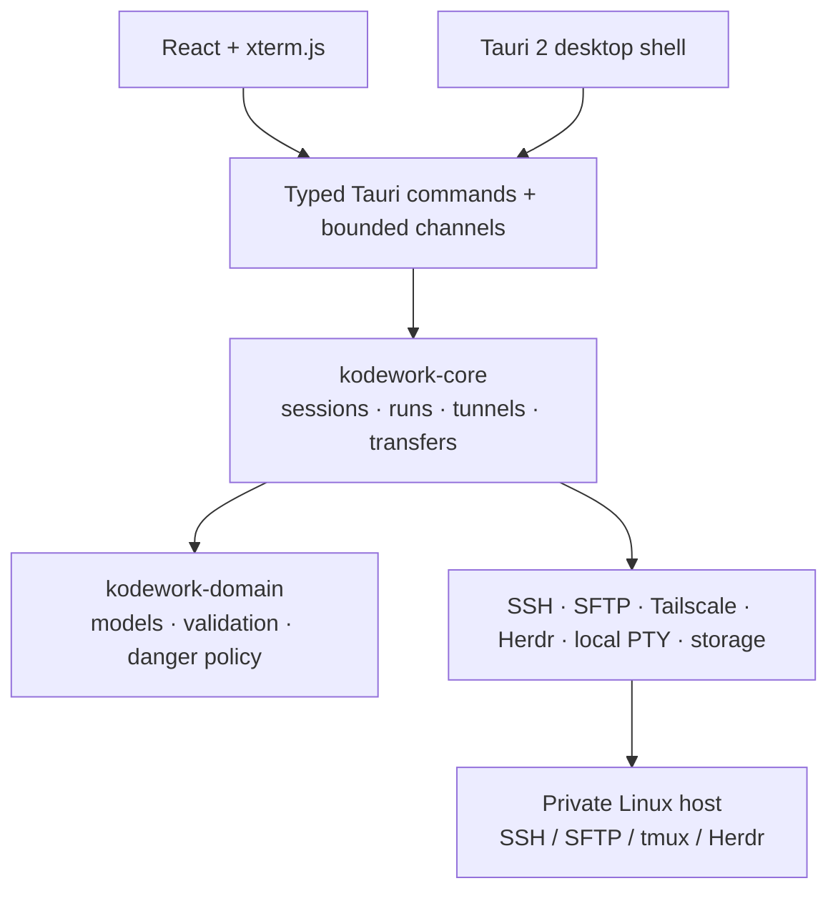

<p align="center">
  
</p>

<h1 align="center">KodeWork</h1>

<p align="center"><strong>A local-first Windows workbench for durable coding sessions on private Linux hosts.</strong></p>

<p align="center">
  <a href="https://github.com/likangmax/KodeWork/actions/workflows/ci.yml"></a>
  <a href="https://github.com/likangmax/KodeWork/releases/latest"></a>
  <a href="LICENSE"></a>
  
</p>

<p align="center">
  <strong>English</strong> · <a href="README.zh-CN.md">简体中文</a>
</p>

<p align="center">
  <a href="https://github.com/likangmax/KodeWork/releases/latest">Download</a> ·
  <a href="docs/USER-GUIDE.md">User guide</a> ·
  <a href="docs/README.md">Documentation</a> ·
  <a href="ROADMAP.md">Roadmap</a> ·
  <a href="SECURITY.md">Security</a> ·
  <a href="SUPPORT.md">Support</a>
</p>

KodeWork turns a private Linux machine into a recoverable remote coding workspace without requiring that machine to expose a public IP. It combines SSH/PTY, SFTP, Tailscale or jump-host routing, tmux/Herdr session continuity, file and asset transfer, SSH port forwarding, and a native Windows desktop workflow.

> Start work on a remote Linux host, disconnect when you need to, and return to the same durable remote session later.

**Distribution truth:** installable binaries are published only through [GitHub Releases](https://github.com/likangmax/KodeWork/releases). The source tree can be ahead of the latest published installer; source version metadata alone is not a release claim.

## What KodeWork is

- **A local-first desktop client.** Connection state, credentials, files, terminals, and remote-session control stay on the user's machine and chosen infrastructure.
- **A private-host workbench.** Direct SSH, Tailscale paths, fallback addresses, and SSH jump hosts can reach Linux machines that are not publicly exposed.
- **A durable-session workflow.** tmux and Herdr can preserve work on the remote host while the Windows client disconnects or restarts.

KodeWork is not a hosted control plane, does not replace SSH host authentication, and does not claim native macOS/Linux desktop releases from cross-platform Rust compilation alone.

## Quick start

### 1. Install

Download the latest **Windows x64 MSI** from [GitHub Releases](https://github.com/likangmax/KodeWork/releases/latest), install it, and launch KodeWork.

The first launch asks for **English** or **简体中文**. The MSI wizard itself is not localized yet.

### 2. Add a workstation

Select **+** beside Workstations and provide:

- Linux username and address;
- SSH authentication method;
- remote working directory;
- optional Tailscale or SSH jump-host route;
- optional tmux or Herdr runtime for durable sessions.

On the first SSH connection, verify the server host-key fingerprint before trusting it.

### 3. Follow the user guide

The [English user guide](docs/USER-GUIDE.md) and [中文使用指南](docs/USER-GUIDE.zh-CN.md) cover Linux preparation, connection modes, files, asset paste, local PowerShell/CMD/WSL terminals, durable sessions, upgrades, and troubleshooting.

## Trust and review at a glance

| Area | Current evidence / boundary |
| --- | --- |
| Desktop distribution | Windows 10/11 x64 MSI is the only released desktop target |
| Portable core | Selected Rust crates are continuously checked on Windows, Linux, and macOS; this is not a native desktop-release claim |
| SSH identity | Unknown host keys require an explicit trust decision; changed known keys are hard failures |
| Credentials | Password/passphrase/auth-key material is kept behind native secret-handling boundaries rather than ordinary renderer/SQLite/log state |
| CI | Frontend lint/tests/build, locked Windows Rust checks/tests, dependency/RustSec/secret policy, and portable Linux/macOS core checks |
| Release | Stable publication validates release lineage/version consistency and fails closed when required updater/AuthentiCode signing material is unavailable |
| Project maturity | Active `0.x` project; verified gaps remain documented instead of being presented as shipped capability |

For the evidence behind these statements, see [Project status](docs/STATUS.md), [Release matrix](docs/RELEASE-MATRIX.md), [Windows test matrix](docs/TEST-MATRIX-WINDOWS.md), [Architecture](docs/ARCHITECTURE.md), and [Security policy](SECURITY.md).

## Why KodeWork

Most SSH clients focus on opening a shell. KodeWork treats the remote machine as a persistent development workspace.

| Need | KodeWork approach |
| --- | --- |
| Reach a private host | Direct/LAN addresses, Tailscale discovery, fallback routes, or an SSH jump host |
| Keep remote work alive | Reattach to tmux or Herdr after local disconnects/restarts |
| Work from one desktop surface | Terminal panes, files, transfers, actions, runtime state, and web previews share project context |
| Avoid credential leakage into UI state | Password/private-key material stays behind native secret-handling boundaries |
| Move large files safely | SFTP streaming with pause/resume/retry/cancel and staged completion |
| Preview remote web services | SSH local port forwarding to loopback-only Web Preview |

## Feature map

| Area | Current functionality |
| --- | --- |
| Network | Direct/fallback addresses, embedded or system Tailscale discovery, SSH jump hosts |
| Remote terminal | Rust SSH/PTY core, xterm.js, split panes, CJK/IME support, reconnect state |
| Durable sessions | tmux and Herdr discovery/attach workflows |
| Authentication | Password, public key, SSH Agent/Pageant, keyboard-interactive/MFA |
| Files | SFTP browsing, streaming transfer, pause/resume/retry/cancel, pinned remote folders |
| Clipboard/assets | Text copy plus explicit screenshot/image/PDF upload into the active remote workspace |
| Local terminals | PowerShell, Command Prompt, and WSL through Windows ConPTY |
| Automation | Interactive, Quick, and Background Actions with Rust-side danger classification |
| Preview | SSH local forwarding and loopback Web Preview |
| Desktop | English/Chinese UI, themes, tray, single instance, autostart, updater-signature verification support |

## Security model

KodeWork handles security-sensitive boundaries explicitly:

- unknown SSH host keys require a fingerprint decision;
- changed known host keys are hard failures;
- trust-store read failures block verification instead of silently downgrading trust;
- passwords, private-key passphrases, and Tailscale auth keys are not ordinary renderer/SQLite/log data;
- dangerous Actions are classified again by Rust, not trusted solely to the UI;
- remote OSC 52 clipboard writes are bounded, while remote clipboard reads are intentionally ignored;
- SFTP uploads remain streamed and staged rather than loading entire files into memory;
- Web Preview is limited to explicit loopback SSH forwarding.

Do not report suspected vulnerabilities in a public issue. Follow [SECURITY.md](SECURITY.md).

## Architecture



Rust owns connection truth, authentication boundaries, reconnect generations, transfer state, and remote-session continuity. React owns presentation and renderer lifecycle. Tailscale can provide the network path; SSH still performs target authentication and host-key verification.

See [Architecture](docs/ARCHITECTURE.md) and the numbered [ADRs](docs/adr/).

## Reviewer's map

If you are evaluating the project rather than just installing it, these are the fastest paths to the source of truth:

- [Project status](docs/STATUS.md) — what is available, verified, released, and still limited;
- [Architecture](docs/ARCHITECTURE.md) — trust boundaries, data flow, state ownership, and performance rules;
- [Security policy](SECURITY.md) — supported versions, private reporting, and runtime security invariants;
- [Windows test matrix](docs/TEST-MATRIX-WINDOWS.md) — automated vs. native acceptance evidence;
- [Release matrix](docs/RELEASE-MATRIX.md) — packaging/signing/platform evidence contract;
- [Changelog](docs/CHANGELOG.md) — user-visible history and unreleased changes;
- [Contributing](CONTRIBUTING.md) and [AGENTS.md](AGENTS.md) — contribution, verification, and coding-agent rules.

The project deliberately distinguishes **configured**, **tested**, **verified**, **supported**, and **released**. Documentation should not upgrade one of those states into another without evidence.

## Development

### Prerequisites

- Windows 10/11 x64 for native desktop development
- Rust 1.98.0 with the MSVC toolchain (`rust-toolchain.toml`)
- Node.js 24+ and npm
- Tauri 2 Windows development prerequisites

### Common commands

```powershell
npm ci
npm run dev              # browser-only UI preview; no native SSH/credentials
npm run desktop          # native Tauri development
npm run lint
npm run test:frontend
npm run build
cargo fmt --all -- --check
cargo clippy --locked --workspace --all-targets --all-features -- -D warnings
cargo test --locked --workspace --all-features
npm audit --omit=dev --audit-level=high
```

For repository rules, testing expectations, and PR guidance, read [CONTRIBUTING.md](CONTRIBUTING.md). Coding agents should start with [AGENTS.md](AGENTS.md).

## Repository layout

```text
crates/        Rust domain, core, transport, storage, and platform adapters
src-tauri/     Thin Tauri shell, typed IPC, plugins, native resources
src/           React workspace, terminal, files, runtime, settings UI
docs/          User guides, architecture, ADRs, test/release evidence
scripts/       Reproducible build, sidecar, and verification helpers
.github/       CI, release automation, issue forms, PR/review ownership
```

## Project status and roadmap

KodeWork is usable today but remains an actively developed `0.x` project. Near-term work focuses on release evidence, connection/recovery reliability, terminal and transfer performance, Windows acceptance, accessibility, and contributor experience.

- [Current project status](docs/STATUS.md)
- [Public roadmap](ROADMAP.md)
- [Support policy](SUPPORT.md)
- [Documentation map](docs/README.md)

## Contributing and support

Focused issues and pull requests are welcome. Start with [CONTRIBUTING.md](CONTRIBUTING.md), use the structured issue forms, and keep real credentials, hostnames, private files, and signing material out of public reports.

- Usage questions and workflow discussion: [GitHub Discussions](https://github.com/likangmax/KodeWork/discussions)
- Reproducible bugs and feature requests: [GitHub Issues](https://github.com/likangmax/KodeWork/issues/new/choose)
- Support boundaries and what to include: [SUPPORT.md](SUPPORT.md)
- Suspected vulnerabilities: [SECURITY.md](SECURITY.md), never a public issue

## License

KodeWork is licensed under the [MIT License](LICENSE). Bundled Tailscale components retain their upstream BSD-3-Clause license; see [third-party notices](docs/THIRD-PARTY-NOTICES.md).
