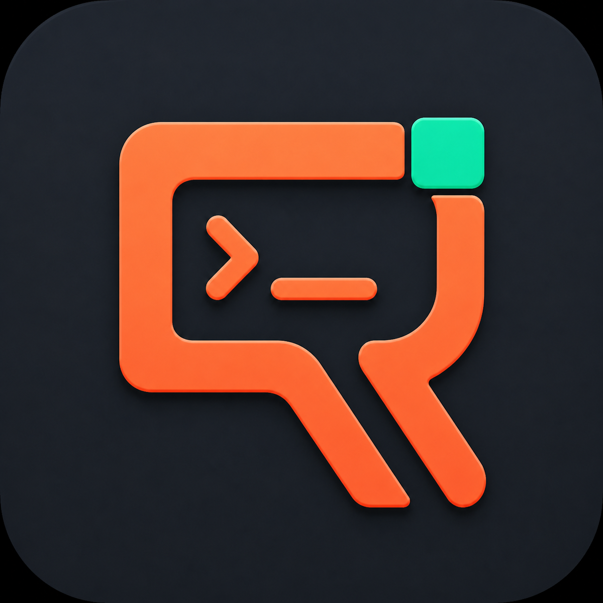
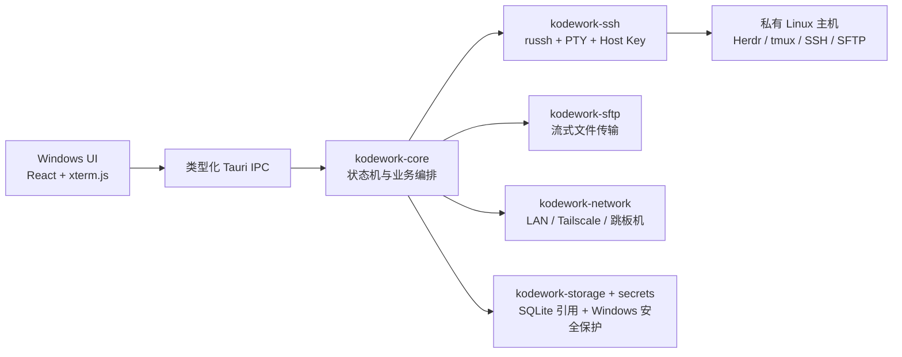

<p align="center">
  
</p>

<h1 align="center">KodeWork</h1>

<p align="center"><strong>面向私有 Linux 主机与持续编码会话的 Windows 远程工作台。</strong></p>

<p align="center">
  <a href="https://github.com/likangmax/KodeWork/actions/workflows/ci.yml"></a>
  <a href="https://github.com/likangmax/KodeWork/releases/latest"></a>
  <a href="LICENSE"></a>
  
</p>

<p align="center"><a href="README.md">English</a> · <strong>简体中文</strong></p>

KodeWork 是一款高性能、本地优先的 Windows 桌面软件，用于连接没有直接暴露在公网中的 Linux 电脑。它把 Tailscale 或 SSH 跳板机、SSH/PTY、Herdr/tmux 会话保持、SFTP、剪贴板文件上传、端口转发预览以及 Windows 原生桌面体验整合到一个工作区中。

KodeWork 不是又一个普通的 SSH 标签页管理器。它围绕一个明确目标设计：

> 在远程 Linux 主机上开始编码任务，随时断开连接，并在回来时继续原来的工作，而不需要给远程主机配置公网 IP。

## 安装

1. 从 [GitHub Releases](https://github.com/likangmax/KodeWork/releases/latest) 下载最新 Windows x64 MSI。
2. 安装 KodeWork，并通过直接地址、Tailscale 或 SSH 跳板机添加 Linux 主机。
3. 首次连接时核对 SSH Host Key 指纹，然后打开终端，或附加已有的 Herdr/tmux 会话。

目前社区构建尚未使用商业 Authenticode 证书签名，因此 Windows SmartScreen 可能显示“未知发布者”。每个 Release 会提供 SHA-256；准确的分发限制见 [项目状态](docs/STATUS.md)，不会把未验证能力写成已完成。

## 为什么选择 KodeWork

大多数 SSH 客户端在“打开一个 Shell”之后就结束了。KodeWork 则把远程电脑视为一个可持续恢复的编码工作区：

1. **连接私有主机** —— 自动发现 Tailscale 地址、尝试备用地址，或通过 SSH 跳板机连接。
2. **恢复持续运行的任务** —— 使用远程主机上的 Herdr 或 tmux，让 Windows 重启、软件退出或网络波动不会终止远程任务。
3. **在同一个工作区完成操作** —— 终端分屏、Actions、Herdr 运行状态、文件、传输、截图/PDF 和 Web Preview 共享同一个项目上下文。
4. **敏感数据留在本机安全边界内** —— 凭据由 Windows 安全存储保护，React 渲染层不会获得私钥内容或密码。

## 功能概览

| 领域 | KodeWork 提供的能力 |
| --- | --- |
| 网络 | 内置用户态 Tailscale、系统 Tailscale 发现、备用地址回退、SSH 跳板机链 |
| 终端 | Rust SSH/PTY 核心、xterm.js 渲染、分屏、中文/IME 输入、断线重连状态 |
| 会话保持 | Herdr 与 tmux 的连接、附加和恢复工作流 |
| 剪贴板 | 鼠标选区复制、Herdr/tmux/Vim OSC 52 写入 Windows 剪贴板，并禁用远端读取 |
| 文件 | 超大目录虚拟滚动、SFTP 流式传输、续传/暂停/重试/取消、每台主机固定目录 |
| 图片与文档 | 粘贴截图、图片或 PDF，验证后上传到当前远程工作区并插入路径 |
| 自动化 | Interactive、Quick、Background Actions，服务端危险分级和 Run 历史 |
| Web Preview | SSH 本地端口转发与回环地址网页预览 |
| Windows 集成 | 托盘运行、单实例、开机自启、签名更新产物、可配置主题 |

## 架构



Rust Core 不依赖 Tauri 类型。桌面 UI 可以替换，而连接生命周期、传输状态、安全策略和远程会话恢复不会与 React 界面绑定。

## 安全原则

- 未知 SSH Host Key 必须由用户确认指纹；已经保存的 Host Key 发生变化时直接阻止连接。
- 密码、私钥口令和 Tailscale Auth Key 不会进入普通前端持久化、命令行参数或日志。
- 危险 Action 会在 Rust 端重新分级，前端无法把危险命令伪装成安全命令。
- OSC 52 只接受有大小限制的 UTF-8 剪贴板写入请求，并明确禁止远端读取本机剪贴板。
- SFTP 上传采用流式和原子暂存方式，不会把整个大文件一次性载入内存。
- 正式版本使用严格 CSP；回环地址 iframe 仅用于用户主动建立的 SSH Web Preview。

## 开发

### 环境要求

- Windows 10/11 x64
- Rust stable + MSVC 工具链
- Node.js 20 或更高版本及 npm
- Tauri 2 Windows 桌面开发依赖

### 常用命令

```powershell
npm ci
npm run dev              # 仅浏览器界面预览，不支持原生 SSH 和凭据
npm run desktop          # Tauri 桌面开发模式
npm run lint
npm run test:frontend
npm run build
cargo fmt --all -- --check
cargo clippy --workspace --all-targets --all-features -- -D warnings
cargo test --workspace --all-features
```

正式构建使用 `scripts/build-release.ps1`。脚本会准备固定版本的 Tailscale sidecar，并生成 MSI 与 Tauri updater 签名。商业 Authenticode 证书由正式分发者在构建环境中提供，不会提交到仓库。

## 仓库结构

```text
crates/kodework-domain       纯领域模型与安全策略
crates/kodework-core         会话、隧道和传输编排
crates/kodework-ssh          SSH、PTY、Host Key 和跳板机
crates/kodework-sftp         流式 SFTP TransferManager
crates/kodework-storage      SQLite 迁移与 Repository
crates/kodework-secrets*     Windows 安全凭据适配器
crates/kodework-tailscale    Tailscale CLI/用户态适配器
crates/kodework-herdr        Herdr CLI 与 Socket Bridge
src-tauri                    精简的类型化 IPC 和 Windows 桌面壳
src                           React 工作区、终端、文件与设置界面
docs                          架构、ADR、状态和发布文档
```

`references/` 是本地使用且被 Git 忽略的上游研究目录。它不是构建输入，也不会随 KodeWork 源码分发。

## 项目状态

KodeWork 当前已经可以使用，但仍处于持续开发的 `0.x` 阶段。近期重点是让远程编码链路更快、更稳定、更自然：

- 缩短建立连接和显示首个终端字节的时间；
- 保证大量输出和多个终端并发时仍然流畅；
- 提升大文件传输速度以及续传可靠性；
- 完善 Windows 睡眠、长期断网和软件重启后的恢复；
- 保持紧凑、键盘优先的 Windows 开发工具体验，而不是通用后台管理页面。

## 参与贡献与安全报告

本项目使用 MIT License，并接受范围清晰的 Issue 与 Pull Request。修改代码前请阅读 [CONTRIBUTING.md](CONTRIBUTING.md)，安全问题请按 [SECURITY.md](SECURITY.md) 私下报告。请勿在 Issue、Pull Request 或日志中提交密码、SSH 私钥、Tailscale Auth Key、更新签名密钥、真实主机名或私人文件。

## 开源协议

KodeWork 使用 [MIT License](LICENSE)。内置的 Tailscale 组件继续遵循其上游 BSD-3-Clause License，详见[第三方版权与许可证说明](docs/THIRD-PARTY-NOTICES.md)。
