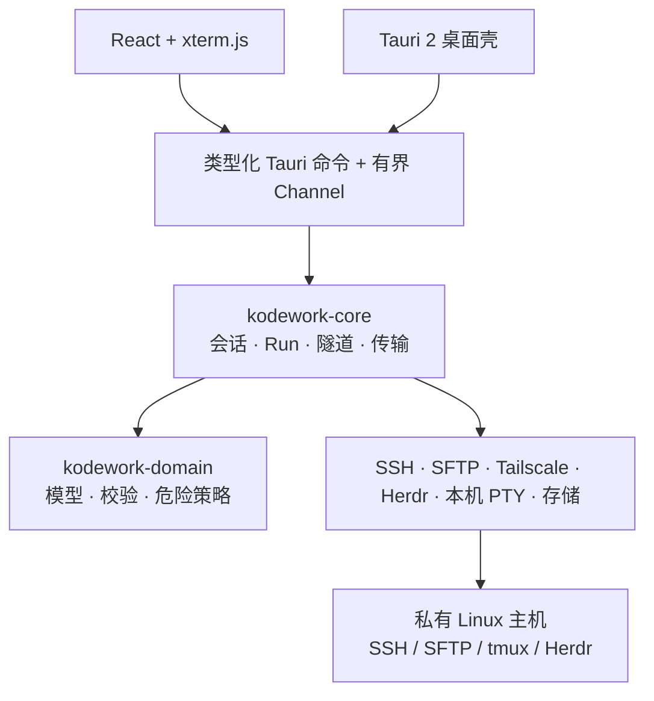

<p align="center">
  
</p>

<h1 align="center">KodeWork</h1>

<p align="center"><strong>面向私有 Linux 主机、支持持久开发会话的本地优先 Windows 远程编码工作台。</strong></p>

<p align="center">
  <a href="https://github.com/likangmax/KodeWork/actions/workflows/ci.yml"></a>
  <a href="https://github.com/likangmax/KodeWork/releases/latest"></a>
  <a href="LICENSE"></a>
  
</p>

<p align="center">
  <a href="README.md">English</a> · <strong>简体中文</strong>
</p>

<p align="center">
  <a href="https://github.com/likangmax/KodeWork/releases/latest">下载</a> ·
  <a href="docs/USER-GUIDE.zh-CN.md">使用指南</a> ·
  <a href="docs/README.md">文档中心</a> ·
  <a href="ROADMAP.md">路线图</a> ·
  <a href="SECURITY.md">安全</a> ·
  <a href="SUPPORT.md">支持</a>
</p>

KodeWork 把一台私有 Linux 机器变成可恢复的远程编码工作区，而不要求这台机器直接暴露公网 IP。它把 SSH/PTY、SFTP、Tailscale 或跳板机网络路径、tmux/Herdr 会话保持、文件与图片/PDF 上传、SSH 端口转发和 Windows 原生桌面流程整合到一个工作台里。

> 在远程 Linux 主机上开始工作，需要时随时断开，之后重新连接并继续原来的持久会话。

**发布口径：** 可安装二进制只以 [GitHub Releases](https://github.com/likangmax/KodeWork/releases) 为准。源码仓库可能领先于最新公开安装包；源码里的版本号本身不等于已经发布。

## KodeWork 是什么

- **本地优先的桌面客户端。** 连接状态、凭据、文件、终端和远端会话控制位于用户自己的电脑与所选基础设施上。
- **面向私有主机的开发工作台。** 支持直连 SSH、Tailscale、备用地址和 SSH 跳板机，适合不直接暴露公网的 Linux 主机。
- **强调持久会话。** tmux 与 Herdr 可以让远端工作在 Windows 客户端断开或重启后继续存在。

KodeWork 不是云端控制平面，不替代 SSH 的主机身份认证，也不会因为 Rust 核心在 macOS/Linux CI 上通过就声称已经发布原生 macOS/Linux 桌面版。

## 快速开始

### 1. 安装

从 [GitHub Releases](https://github.com/likangmax/KodeWork/releases/latest) 下载最新的 **Windows x64 MSI**，安装并启动 KodeWork。

首次启动会让你选择 **简体中文** 或 **English**。MSI 安装向导本身目前尚未本地化。

### 2. 添加工作站

点击 Workstations 旁边的 **+**，配置：

- Linux 用户名和地址；
- SSH 认证方式；
- 远程工作目录；
- 可选 Tailscale 或 SSH 跳板机路径；
- 可选 tmux 或 Herdr，用于持久远程会话。

第一次 SSH 连接时，请先核对服务器 Host Key 指纹，再决定是否信任。

### 3. 按指南完成配置

[中文使用指南](docs/USER-GUIDE.zh-CN.md) 与 [English user guide](docs/USER-GUIDE.md) 覆盖 Linux 准备、连接方式、文件传输、图片/PDF 粘贴、本机 PowerShell/CMD/WSL、持久会话、升级和故障排查。

## 可信度与审查信息一览

| 领域 | 当前证据 / 边界 |
| --- | --- |
| 桌面分发 | 目前只发布 Windows 10/11 x64 MSI |
| 可移植核心 | 部分 Rust crate 持续在 Windows、Linux、macOS 检查；这不等于原生桌面版已经发布 |
| SSH 身份 | 未知 Host Key 必须显式确认；已知 Host Key 变化时直接失败 |
| 凭据 | 密码、口令、Auth Key 等保留在原生安全处理边界内，不作为普通前端/SQLite/日志状态 |
| CI | 前端 lint/test/build、Windows Rust locked 检查与全量测试、依赖/RustSec/secret policy、Linux/macOS portable core |
| 发布 | 稳定发布会校验 tag 与 main 的关系、版本一致性；缺少必要 updater/Authenticode 签名材料时 fail closed |
| 项目成熟度 | 仍是持续开发的 `0.x` 项目；未验证项保持明确可见，不会包装成已发布能力 |

这些结论的证据入口见：[项目状态](docs/STATUS.md)、[发布矩阵](docs/RELEASE-MATRIX.md)、[Windows 测试矩阵](docs/TEST-MATRIX-WINDOWS.md)、[架构说明](docs/ARCHITECTURE.md) 和 [安全策略](SECURITY.md)。

## 为什么做 KodeWork

大多数 SSH 客户端的核心是“打开一个 Shell”。KodeWork 更强调把远程机器当作一个长期工作的开发工作区。

| 需求 | KodeWork 的做法 |
| --- | --- |
| 连接私有主机 | 直连/LAN、Tailscale 发现、备用地址或 SSH 跳板机 |
| 保持远端任务 | 本机断开或重启后重新附加 tmux/Herdr |
| 在一个桌面里工作 | 终端分屏、文件、传输、Actions、运行状态和 Web Preview 共用项目上下文 |
| 减少凭据进入前端状态 | 密码/私钥材料留在原生安全处理边界内 |
| 安全传输大文件 | SFTP 流式传输、暂停/继续/重试/取消、暂存后完成 |
| 预览远端 Web 服务 | SSH 本地端口转发到回环地址 Web Preview |

## 功能概览

| 领域 | 当前能力 |
| --- | --- |
| 网络 | 直连/备用地址、内置或系统 Tailscale 发现、SSH 跳板机 |
| 远程终端 | Rust SSH/PTY 核心、xterm.js、分屏、中文/IME、重连状态 |
| 持久会话 | tmux 与 Herdr 的发现、附加与恢复流程 |
| 认证 | 密码、公钥、SSH Agent/Pageant、Keyboard-interactive/MFA |
| 文件 | SFTP 浏览、流式传输、暂停/继续/重试/取消、固定远程目录 |
| 剪贴板与素材 | 文本复制，以及显式上传截图、图片、PDF 到当前远程工作区 |
| 本机终端 | Windows ConPTY 下的 PowerShell、CMD 和 WSL |
| 自动化 | Interactive、Quick、Background Actions，Rust 端危险级别判定 |
| 预览 | SSH 本地端口转发和回环 Web Preview |
| 桌面体验 | 中英文、主题、托盘、单实例、自启、updater 签名验证支持 |

## 安全边界

KodeWork 对以下边界采用显式策略：

- 未知 SSH Host Key 必须由用户确认指纹；
- 已知 Host Key 发生变化时直接阻断连接；
- trust store 读取失败时阻断验证，而不是静默降级；
- 密码、私钥口令、Tailscale Auth Key 不作为普通前端/SQLite/日志数据保存；
- 危险 Actions 会在 Rust 端再次判定，不能只依赖前端；
- 远端 OSC 52 写剪贴板有长度边界，远端读取本机剪贴板则明确忽略；
- SFTP 上传保持流式和暂存式完成，不为方便而整文件读入内存；
- Web Preview 只允许用户主动建立的回环 SSH 转发。

发现疑似安全漏洞时，请不要提交公开 Issue，按 [SECURITY.md](SECURITY.md) 私下报告。

## 架构



Rust 负责连接真相、认证边界、重连代数、传输状态和远程会话连续性；React 负责界面与渲染器生命周期。Tailscale 可以提供网络路径，但目标认证和 Host Key 校验仍由 SSH 负责。

进一步阅读：[架构说明](docs/ARCHITECTURE.md) 和编号 [ADR](docs/adr/)。

## 审查者快速入口

如果你是在评估项目，而不是单纯安装，建议直接看这些“源事实”文档：

- [项目状态](docs/STATUS.md) — 哪些能力是可用、已验证、已发布，以及已知限制；
- [架构说明](docs/ARCHITECTURE.md) — 信任边界、数据流、状态归属与性能规则；
- [安全策略](SECURITY.md) — 支持版本、私下漏洞报告方式与运行时安全不变量；
- [Windows 测试矩阵](docs/TEST-MATRIX-WINDOWS.md) — 自动化证据与真机验收证据的区别；
- [发布矩阵](docs/RELEASE-MATRIX.md) — 打包、签名和平台声明的证据门槛；
- [更新日志](docs/CHANGELOG.md) — 已发布历史与未发布变更；
- [贡献指南](CONTRIBUTING.md) 与 [AGENTS.md](AGENTS.md) — 贡献、验证与 Coding Agent 规则。

项目会严格区分 **configured（已配置）**、**tested（已测试）**、**verified（已验证）**、**supported（受支持）** 和 **released（已发布）**，没有对应证据时不会把其中一种状态写成更强的结论。

## 开发

### 环境要求

- Windows 10/11 x64（原生桌面开发）
- Rust 1.98.0 + MSVC 工具链（见 `rust-toolchain.toml`）
- Node.js 24+ 和 npm
- Tauri 2 Windows 开发依赖

### 常用命令

```powershell
npm ci
npm run dev              # 仅浏览器 UI 预览，不包含原生 SSH/凭据能力
npm run desktop          # Tauri 原生桌面开发
npm run lint
npm run test:frontend
npm run build
cargo fmt --all -- --check
cargo clippy --locked --workspace --all-targets --all-features -- -D warnings
cargo test --locked --workspace --all-features
npm audit --omit=dev --audit-level=high
```

仓库开发规则、测试证据和 PR 要求见 [CONTRIBUTING.md](CONTRIBUTING.md)。Coding Agent 应先读 [AGENTS.md](AGENTS.md)。

## 仓库结构

```text
crates/        Rust 领域、核心编排、传输、存储和平台适配器
src-tauri/     精简 Tauri 桌面壳、类型化 IPC、插件和原生资源
src/           React 工作区、终端、文件、运行时与设置界面
docs/          用户指南、架构、ADR、测试与发布证据
scripts/       可复现构建、sidecar 和验证脚本
.github/       CI、发布自动化、Issue 表单、PR 与审查归属
```

## 项目状态与路线图

KodeWork 当前已经可以使用，但仍是持续开发中的 `0.x` 项目。近期重点是发布证据、连接/恢复可靠性、终端与传输性能、Windows 原生验收、可访问性和外部贡献体验。

- [当前项目状态](docs/STATUS.md)
- [公开路线图](ROADMAP.md)
- [支持策略](SUPPORT.md)
- [文档中心](docs/README.md)

## 参与贡献与获取支持

欢迎范围明确的 Issue 与 Pull Request。请先读 [CONTRIBUTING.md](CONTRIBUTING.md)，优先使用结构化 Issue 表单，并确保公开内容里没有真实凭据、主机名、私人文件或签名材料。

- 使用问题与经验交流：[GitHub Discussions](https://github.com/likangmax/KodeWork/discussions)
- 可复现 Bug 与功能请求：[GitHub Issues](https://github.com/likangmax/KodeWork/issues/new/choose)
- 支持范围与提交信息要求：[SUPPORT.md](SUPPORT.md)
- 疑似安全漏洞：[SECURITY.md](SECURITY.md)，不要发公开 Issue

## 开源协议

KodeWork 使用 [MIT License](LICENSE)。内置 Tailscale 组件继续遵循上游 BSD-3-Clause License，详见 [第三方版权与许可证说明](docs/THIRD-PARTY-NOTICES.md)。
