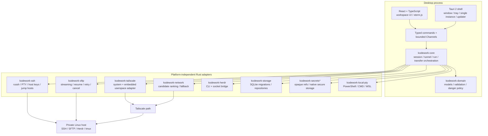

# KodeWork architecture

> The implementation baseline for the current `0.x` Windows release. This document describes boundaries that are enforced by the workspace and tested by CI; it is not a future-state mock-up.

## System view



## Runtime boundaries

| Boundary | Owns | Must not own |
| --- | --- | --- |
| `src/` | view state, layout, keyboard routing, renderer lifecycle | credentials, SSH sockets, filesystem secrets, connection truth |
| `src-tauri/` | thin command/DTO translation, desktop plugins, tray and window lifecycle | business rules, retry policy, SFTP implementation |
| `kodework-core` | connection generations, session lifecycle, actions/runs, tunnels, transfer orchestration | Tauri types or React state |
| `kodework-domain` | stable models, validation, explicit state machines, danger classification | I/O, platform APIs, persistence |
| adapter crates | one integration boundary each (SSH, SFTP, Tailscale, Herdr, local PTY, storage, secrets) | cross-cutting UI policy |

The dependency direction is deliberately one-way:

```text
UI -> Tauri shell -> core -> domain
                         -> adapters
```

The core and domain crates are Tauri-independent so the same connection and transfer logic can be reused by a future macOS/Linux shell or a background agent.

## Data planes

### Control plane

Low-frequency typed commands create and control resources: connect, disconnect, resize, run an Action, list a directory, enqueue a transfer, and update a pinned folder. Commands return typed results or typed errors.

### Data plane

High-frequency streams never use one IPC call per byte. Rust aggregates terminal output into bounded frames and sends ordered `TerminalFrame` values through a Tauri Channel. Transfer and Run output use the same pattern, with cancellation and backpressure. A connection generation is attached to every frame so output from an obsolete connection cannot overwrite a newer one.

```text
keyboard input -> bounded input queue -> SSH/local PTY
SSH/local PTY output -> 8–16 ms or 4–32 KiB frame -> xterm.js
file bytes -> streaming SFTP -> .part -> atomic rename -> completion event
```

## Durable remote work

KodeWork is a client, not the process supervisor for the remote coding task. Herdr or tmux runs on the Linux host. A Windows restart, tray exit, sleep cycle, or network flap therefore leaves the remote job alive; the next connection re-attaches to the same durable session. Local PTY sessions are intentionally separate and are terminated with the desktop process.

Quick and Background Actions are persisted separately from their mutable Action
definition. Each Run stores the host, project, command, mode, and working-folder
snapshot captured at launch. A detached Background Run starts as `Running`; the
tmux launcher returning zero is not treated as command success. The remote
wrapper atomically writes an exit-code marker under
`~/.cache/kodework/runs/<run-id>/`, and `run_reconcile` compares that marker and
the tmux session after reconnect. If neither source is authoritative, the UI
shows `Unknown` instead of guessing failure or success. Deleting an Action or
Project does not erase its historical Run; deleting the Host intentionally
removes all host-owned records.

Quick Actions apply their configured timeout to the observed SSH command and
record `TimedOut` when that deadline expires. Interactive and Background
Actions have no local command deadline: Interactive is dispatched to the PTY,
while Background execution is owned by the remote tmux wrapper. During startup,
queued or running Quick Runs left by a terminated desktop process are marked
`Interrupted`; detached Background Runs are left available for reconciliation.

Run history stores lifecycle metadata, command snapshots, and byte counts only.
Stdout/stderr previews are kept in memory for the active result view and are
never persisted to SQLite; migration 11 also clears previews written by older
versions.

## Address and authentication flow

1. Resolve a host into ordered candidates (manual, LAN, Tailscale, public, or jump-host route).
2. Try candidates with bounded timeouts and typed failure classification.
3. Verify the SSH host-key fingerprint before accepting the session. Trust is bound to the logical `HostId`, so LAN, Tailscale, and public fallback paths for one workstation must present the same identity; legacy address-scoped records remain a compatibility fallback. A changed key is a hard failure.
4. Authenticate with password, private key, Windows SSH Agent/Pageant, or keyboard-interactive prompts.
5. Create independent PTY, exec, SFTP, and tunnel channels under one connection generation.
6. Event pumps reject stale transport generations before forwarding data or
   adding it to the bounded pane replay buffer, so reconnects cannot mix old
   output into the new session.

Tailscale supplies a network path or address discovery. It does not replace SSH authentication or host-key verification.

## Security boundary

- SQLite stores host/project metadata and opaque credential references, never secret values.
- Windows credentials use native protected storage; private-key material is handled by the platform adapter.
- Auth keys are short-lived inputs and are never written to README files, fixtures, logs, or ordinary renderer persistence.
- Remote paths are validated before clipboard-asset upload; uploads are staged and atomically renamed.
- Dangerous Actions are reclassified in Rust. Clearly observational commands
  are Safe, known destructive commands are Dangerous, and unknown shell
  constructs are Review; a UI flag cannot downgrade the server decision.
- Herdr socket bridges record the exact remote `socat` PID, verify readiness,
  and stop only that owned process. They never use broad `pkill -f` matching.
- Host-key identities were introduced per logical Host in schema v10, preventing
  an address fallback from silently becoming a different trusted workstation;
  the current storage schema is v11, which also removes persisted run output.
- Production CSP is restrictive; loopback frames are allowed only for an explicit SSH Web Preview tunnel.

See the numbered decisions in [`adr/`](adr/) for the rationale behind these boundaries.

## Performance invariants

- Bounded queues and bounded terminal replay buffers.
- No `read_to_end` for large transfers; a 512 MiB fixture is covered by the test suite.
- Resume never trusts `.part` length alone: the existing prefix is compared
  byte-for-byte with the current source, and a mismatch restarts safely.
- At most 20 local/remote terminal sessions per workspace, with inactive renderers detached or paused.
- Fixed-row virtual windows for large remote directories.
- Single-flight reconnect, host-key, and keyboard-interactive polling.
- Native reconnect retry/backoff is single-flight per logical `HostId`; the renderer only requests supervision and reflects state.
- Generation guards on reconnect and explicit cleanup of dead subscribers.

## Verification

The repository's release gates are listed in [`STATUS.md`](STATUS.md) and the test evidence is maintained in [`TEST-MATRIX-WINDOWS.md`](TEST-MATRIX-WINDOWS.md). A green compile is not treated as proof of real Tailscale, Herdr, sleep/wake, or installer behavior; those environments are labeled separately.
